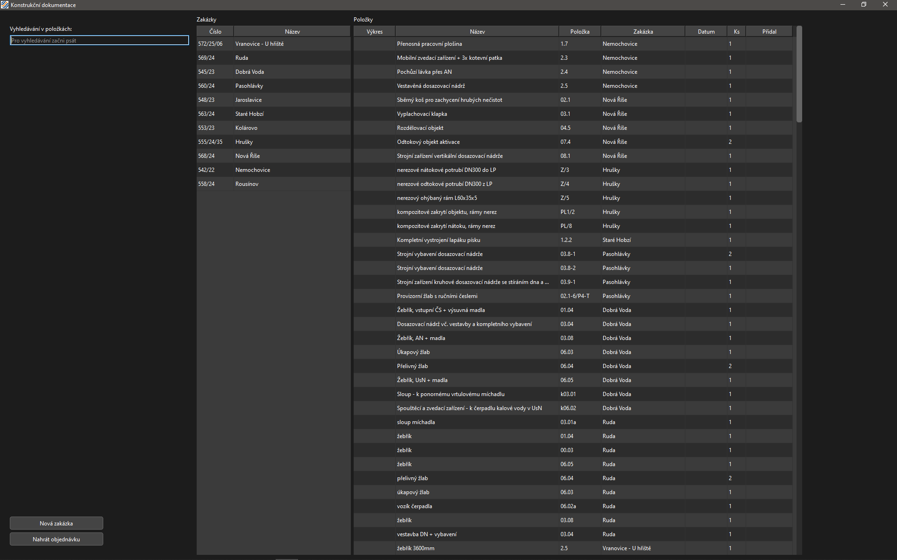
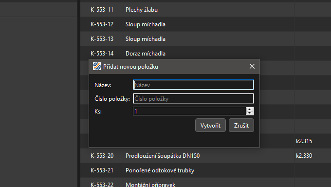
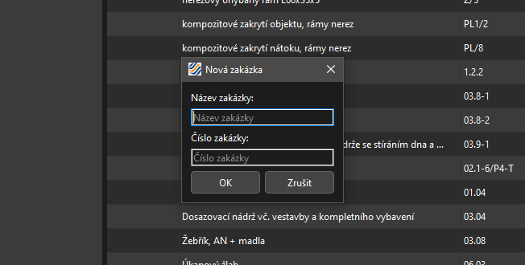
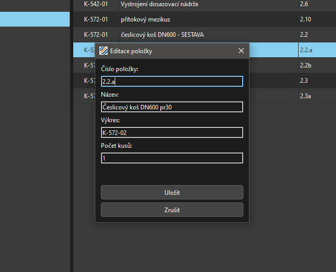
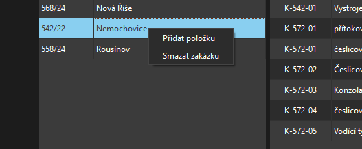
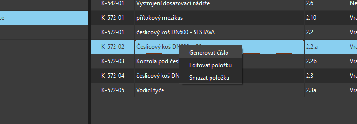

# 🖥️ Aplikace pro číslování výrobní dokumentace

Tato desktopová aplikace slouží k **evidenci zakázek a automatickému číslování výrobní dokumentace**. Umožňuje přehlednou správu položek, import objednávek a generování čísel výkresů dle firemního standardu.

---

## ✨ Funkce

- ✅ Vytváření zakázek a přidávání položek
- 📎 Import objednávek ve formátu **PDF** (automatické načtení čísla zakázky a položek)
- 🔢 Automatické generování čísel výkresů ve formátu `K-XXX-YY`, např. `K-546-01`
- 🕒 Záznam data a přihlášeného uživatele (z Windows) při generování čísla
- ✏️ Úpravy položek, možnost ručně mazat a měnit čísla výkresů
- 🧹 Automatické odstranění metadat při smazání čísla výkresu
- 🔍 Vyhledávání a filtrování

---

## ⚙️ Použité technologie

- 🐍 **Python**
- 🖼️ **[PySide6](https://doc.qt.io/qtforpython/)** – uživatelské rozhraní
- 💾 **SQLite** – lokální databáze pro ukládání zakázek a položek
- 📄 **PDF parsing** – extrakce informací z objednávek

---

## 🧭 Průběh práce

1. **Vytvoření zakázky**  
   Zakázku lze vytvořit ručně nebo automatickým importem PDF objednávky.

2. **Přidání položek**
   - Manuálně (pravým kliknutím na zakázku → *Vytvořit položku*)
   - Automaticky při importu objednávky

3. **Generování čísel výkresů**
   - Pravý klik na položku → *Generovat číslo*
   - Číslování ve formátu `K-[číslo zakázky]-[pořadí]` (např. `K-123-01`, `K-123-02`…)

4. **Editace položky**
   - Možnost ručně změnit nebo odstranit číslo výkresu
   - Při odstranění čísla se automaticky vymaže i datum a jméno autora

5. **Chytrá posloupnost**
   - Pokud ručně změníš číslo výkresu (např. `K-546-04` → `K-546-07`), systém při dalším generování pokračuje číslem `K-546-08`
  
6. **Vyhledávání a filtrování**
   - Po kliknutí na konkrétní zakázku se zobrazí pouze položky, které k ní přísluší.
   - V levém horním rohu se nachází vyhledávací pole, které při psaní dynamicky filtruje seznam položek.
      - Filtr prohledává sloupce „Název“ a „Zakázka“.
      - Vyhledávání probíhá okamžitě během psaní (bez potvrzení).

---

## 🖼️ Ukázky rozhraní
| Hlavní okno | Nová položka | Nová zakázka |
|------------|--------------|---------------|
|  |  |  |

| Editace položky | Kontextové menu (zakázka) | Kontextové menu (položka) |
|------------------|-----------------------------|------------------------------|
|  |  |  |

---

> ⚠️ Aplikace je určena pro prostředí Windows
